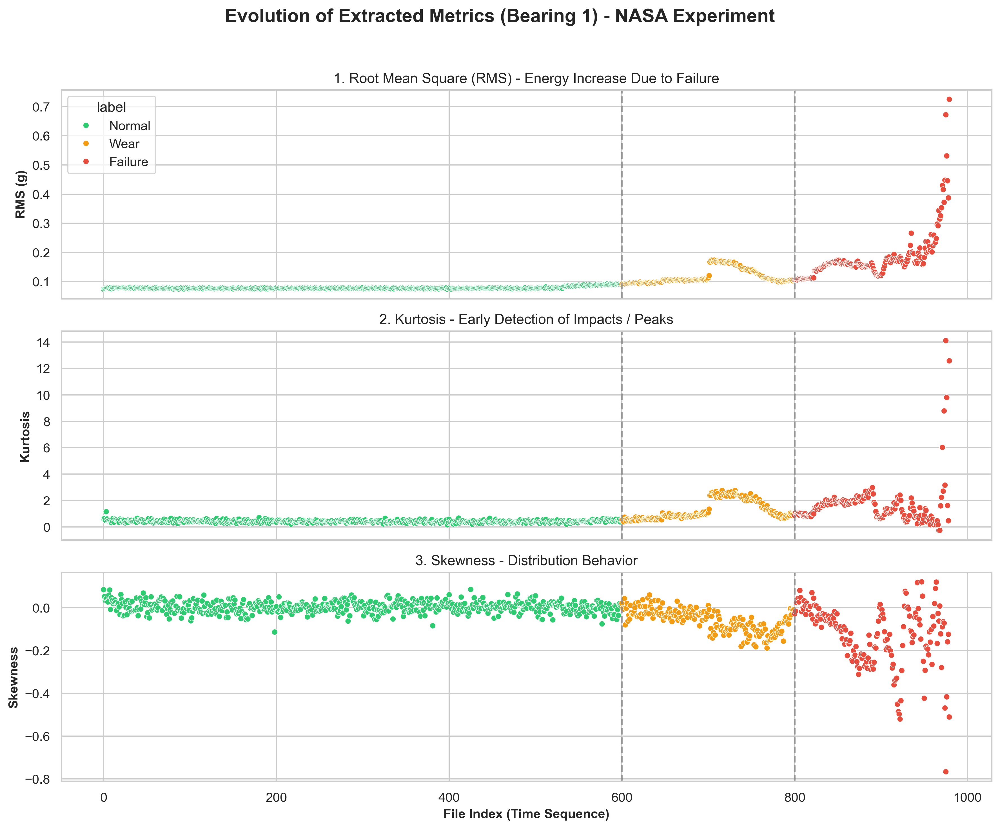
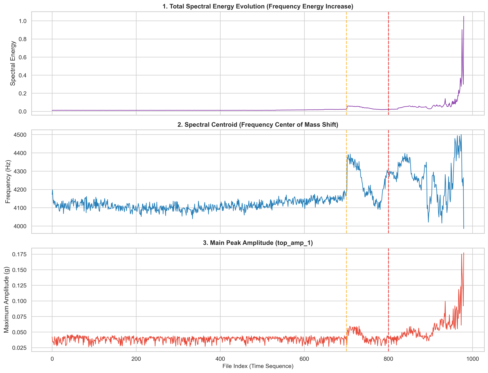
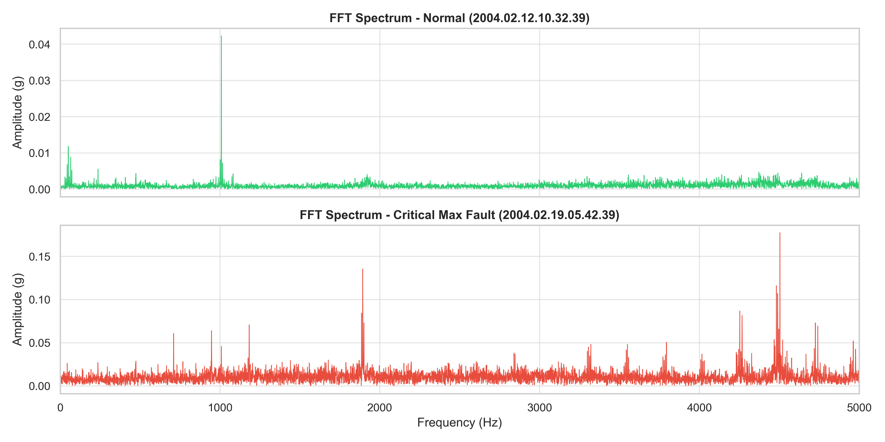
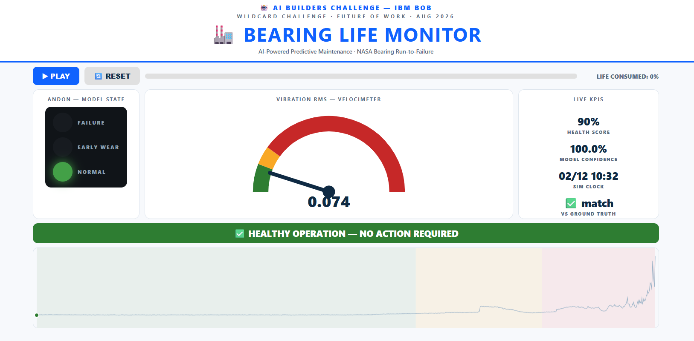
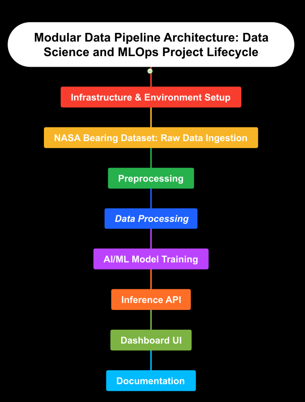
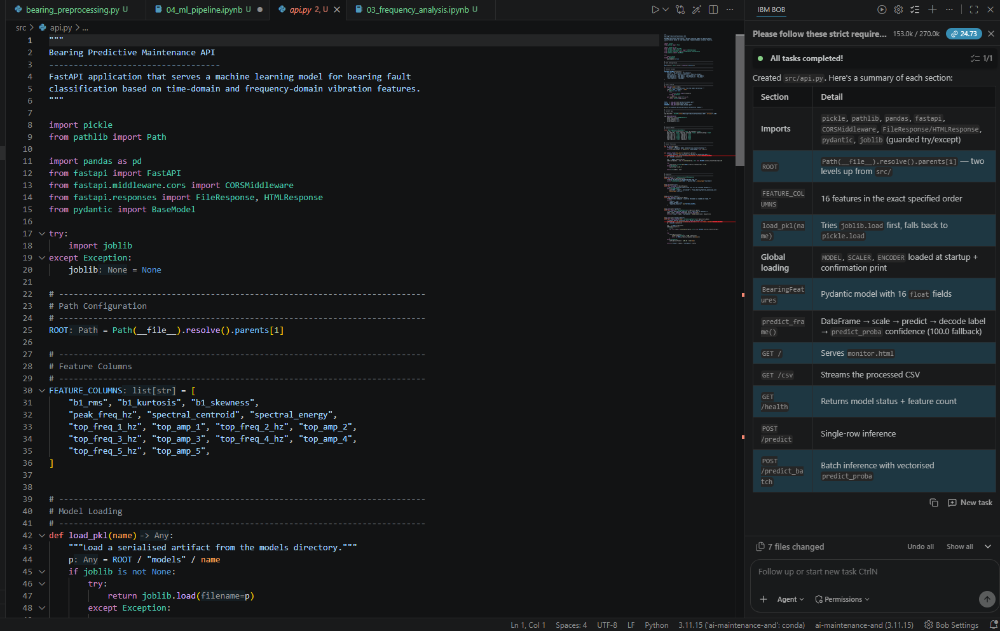
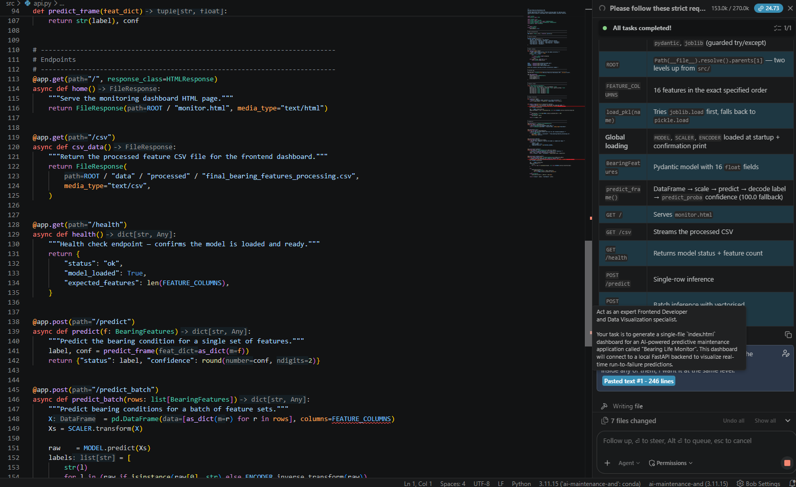
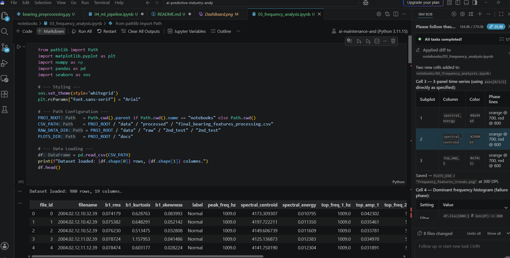

# AI-Predictive-Industry: Industrial Predictive Maintenance System with IBM Bob

## Selected Challenge Theme
**August Wildcard Challenge**
*Focus: Artificial Intelligence applied to Industry 4.0 and Predictive Maintenance.*
With the assistance of **IBM Bob**, IBM's AI assistant, it was developed an AI-powered industrial predictive maintenance system.

---

## 💡 Problem Statement & Solution

### The Problem
In industry, unforeseen failures of rotating components (such as bearings) severely impact sectors like aerospace, energy, and automotive — to name just a few. These failures generate high costs and unplanned downtime, where the currency of *time* is gravely consumed.

### Proposed Solution
An **end-to-end, real-time industrial monitoring and predictive maintenance system** that uses vibration-signal analysis and Artificial Intelligence models to detect degradation *before* a critical failure occurs, developed with IBM Bob as the technical AI agent.

---

## 🧠 AI Approach & Architecture

### 1. Dataset & Data Origin: NASA Bearing Dataset (IMS, University of Cincinnati)
For debugging, training, and validating the AI solution, the **NASA Bearing Dataset (Set No. 2) was used**.

* **Origin:** Center for Intelligent Maintenance Systems (IMS), University of Cincinnati / NASA Ames.
* **Experimental setup:** 4 bearings (Rexnord ZA-2115) mounted on a shaft driven by an AC motor at **2,000 RPM** with a **6,000 lb radial load**.
* **Sampling:** 984 flat ASCII vibration-signal files — 1-second snapshots sampled at **20.48 kHz** (a sampling frequency of 20,480 Hz), recorded **every 10 minutes**.
* **Channels:** 4 ICP accelerometers (Channel 1: Bearing 1, Channel 2: Bearing 2, Channel 3: Bearing 3, Channel 4: Bearing 4).

### 2. Signal Processing & Exploratory Data Analysis (EDA)

* **Preprocessing:**
  The raw dataset contains **20,152,320 gravity (g) data points**, making it expensive, noisy, and unstable to feed directly into a model. Using digital signal processing and time-series analysis, the information was compressed into three statistical "vital signs":
  * **Root Mean Square (RMS):** a measure of the total vibration energy — it tracks overall severity as damage progresses.
  * **Kurtosis:** detects outliers and extreme peaks (impacts) — our *early-warning* indicator of localized defects.
  * **Skewness:** measures the asymmetry of the amplitude distribution — it confirms that the vibration pattern has become one-sided (e.g., rubbing or misalignment).

Figure 1, shows the bearing system behavior through the aforementioned metrics:

  
   
  <b>Figure 1:</b> Bearing Degradation Behavior - NASA Bearing Dataset.

* **Processing (Time → Frequency domain):**
  In its raw form, the data lives in a two-dimensional amplitude-vs-time plane (the **time domain**). Using advanced mathematics — specifically the **Fast Fourier Transform (FFT)** — the signals were converted from the time domain to the **frequency domain** to extract relevant information.
  
  * **Spectral Centroid:** measures the change in energy distribution.
  * **Spectral Energy:** measures the power contained in the frequency waves.
  * **Main Peak Amplitude:** represents the maximum instantaneous force exerted by the dominant phenomenon at that moment.
  
  Figure 2, shows the behavior of the three spectral variables mentioned above:

  
   
  <b>Figure 2:</b> Frequency Features Trends.

 

* **FFT:** Conversion of the signals to the frequency domain to extract key metrics (amplitude peaks and bearing fault frequencies).
* **The top 5 highest-amplitude peaks allow us to trace the transition in frequency changes.

Figure 3, contains the graph of the top 5 highest-amplitude frequencies for a single file:

  
   
  <b>Figure 3:</b> Top 5 Frequency Peaks.

 

### 3. Machine Learning / AI Model
* **Models evaluated:** Three distinct machine learning models were trained and compared to guarantee the highest reliability of the AI-powered predictive maintenance system: **Random Forest, SVC, and Gradient Boosting**.
* **Evaluation metrics:** Accuracy, Precision, Recall, and F1-Score.
* **Winning model:** **Random Forest** 🏆

| Model | Accuracy | Precision | Recall | F1-Score |
|---|---|---|---|---|
| Gradient Boosting | 0.9745 | 0.9753 | 0.9745 | 0.9743 |
| SVC (RBF) | 0.9541 | 0.9578 | 0.9541 | 0.9552 |
| **Random Forest** 🏆 | **0.9847** | **0.9853** | **0.9847** | **0.9845** |

### 4. System Architecture
The complete data flow and components:

1. **Data Ingestion:** Reading the vibration files from the NASA dataset.
2. **Feature Extraction:** Digital signal processing with FFT and statistical feature extraction in Python.
3. **Backend API (FastAPI):** A REST endpoint (`/predict`) that receives sensor data and returns the failure prediction and risk level.
4. **Frontend / Dashboard:** A real-time graphical interface that visualizes the bearing's health state (andon traffic light, RMS velocimeter, and full lifecycle chart), served by the FastAPI backend.

Figure 4, shows the monitoring dashboard for the AI-powered industrial predictive maintenance system.

  
   
  <b>Figure 3:</b> Bearing Life Monitor.

### 5. Modular Data-Pipeline Architecture (Data Pipelines & MLOps Lifecycle)
Figure 5, shows the flow diagram of the modular, data-pipeline-oriented architecture — the full lifecycle of a data science and MLOps project, where each stage's output becomes the next stage's input.

  
   
  <b>Figure 5:</b> Modular Data Pipeline Architecture: Data Science and MLOps Project Lifecycle.

 

---

## 🏎️ Why It Matters in a Racing Context
Racing teams continuously stream telemetry — vibration, temperature, RPM — from hundreds of sensors to predict component failures *before* they force a retirement. A bearing failure at 300 km/h is not just a lost race; it is a safety hazard. Our system applies that same **pit-crew philosophy** to industry: it turns raw vibration into a live, actionable verdict (Normal → Early Wear → Imminent Failure), so maintenance crews act *before* the failure, exactly like an F1 crew deciding to replace a component during a pit stop. Racing-grade telemetry, applied to the factory floor.

---

## 🤖 IBM Bob Usage
IBM Bob functioned as an active technical co-pilot throughout the entire MLOps lifecycle, significantly accelerating development time and ensuring code robustness across the data engineering, machine learning, and deployment phases.

### 1. Signal Processing & Feature Engineering
IBM Bob was instrumental in writing and optimizing the digital signal processing pipelines. It generated the vectorized NumPy and SciPy code required to extract time-domain statistical features (RMS, Kurtosis, Skewness) and frequency-domain metrics (FFT, Spectral Centroid, Spectral Energy) from the massive 20.48 kHz NASA vibration dataset.

  
   
  <b>Figure X:</b> IBM Bob generating the SciPy/NumPy signal processing and label assignment code.

### 2. Machine Learning Pipeline & Evaluation
During the modeling phase, IBM Bob assisted in structuring the `scikit-learn` pipeline. It provided the implementation for data scaling (`StandardScaler`), the comparative training loop for the three evaluated models (Random Forest, SVC, Gradient Boosting), and the generation of evaluation metrics, including the confusion matrix and classification reports.

  
   
  <b>Figure Y:</b> IBM Bob structuring the scikit-learn model training and evaluation loop.

### 3. Backend API Development (FastAPI)
For the deployment phase, IBM Bob designed the RESTful API using FastAPI. It generated the Pydantic schemas for validating the 16 incoming sensor features, configured the CORS middleware, and implemented the inference logic using `joblib` to load the trained Gradient Boosting model efficiently.

  
   
  <b>Figure Z:</b> IBM Bob generating the FastAPI endpoint, Pydantic models, and inference logic.

---

## 🎯 Prompting Strategy & Optimization
To maximize the efficacy of IBM Bob, a structured "Role + Context + Constraint" prompting strategy was systematically applied. This approach ensured that the generated code was not only functional but also optimized for performance and integrated seamlessly into the existing architecture.

### Case Study 1: FastAPI Endpoint Generation
> **Prompt:** *"Act as a Senior Backend Engineer. Write a FastAPI POST endpoint named `/predict` that receives a JSON payload of 16 specific vibration features (RMS, Kurtosis, FFT peaks, etc.). Use Pydantic for strict data validation. The endpoint should load a pre-trained scikit-learn model using `joblib`, scale the input data, and return the predicted status and confidence score. Include error handling for malformed payloads."*

**Result:** IBM Bob generated a highly optimized, production-ready FastAPI script on the first iteration, complete with accurate Pydantic modeling and asynchronous inference logic, saving approximately 2–3 hours of manual API structuring and debugging.

  
   
  <b>Figure W:</b> Prompting strategy for FastAPI generation and IBM Bob's optimized response.

### Case Study 2: Vectorized FFT Extraction
> **Prompt:** *"Act as a Senior Data Scientist. Write a Python function using `scipy.fft` to calculate the spectral centroid and identify the top 5 highest-amplitude peaks from a 1-second vibration signal array sampled at 20.48 kHz. Ensure the code is fully vectorized using NumPy for performance and include a docstring explaining the physical meaning of the spectral centroid in bearing fault detection."*

**Result:** IBM Bob provided a mathematically accurate, vectorized implementation that correctly mapped the frequency bins to physical Hz values, significantly reducing the time required to debug the frequency-domain feature extraction.

  
   
  <b>Figure V:</b> Prompting strategy for FFT extraction and IBM Bob's vectorized code generation.

